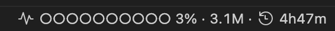
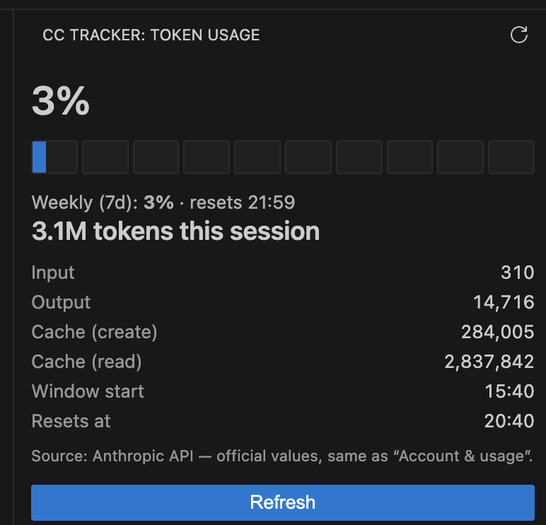

# CC Tracker — Claude Code Usage

Shows Claude Code token usage for the active **5-hour limit window** and the **time until it
resets** — right inside VS Code.

## Screenshots

Status bar gauge — usage, tokens, and reset timer at a glance:



Side panel — official 5-hour and weekly usage with a token breakdown:



## Features

- **Status bar**: a solid fill gauge + percentage + absolute token count + reset timer.
  ```
  ◉ ●○○○○○○○○○ 13% · 24.6M · ⏱ 1h25m
  ```
- **Side panel** (CC Tracker icon in the Activity Bar): a precise 10-cell gauge filled by
  percentage, token breakdown (input / output / cache), the weekly (7d) limit, and reset time.
- **Official values only**: the percentage and reset time come from the Anthropic API
  (`/api/oauth/usage`) — the exact numbers Claude Code shows in *Account & usage*. There is no
  local guess, so the percentage never jumps around.
- **When the API is briefly unavailable** (a poll fails, offline): the last known value is kept
  and marked *stale* until a fresh poll succeeds. Until the very first value arrives, the gauge
  shows *waiting for API*.
- The absolute token count for the session is computed locally from
  `~/.claude/projects/**/*.jsonl`.

## How it works

Claude Code limits reset on a rolling 5-hour window. The extension queries the official
values from the Anthropic API (`GET https://api.anthropic.com/api/oauth/usage`) — the exact
source behind Claude Code's *Account & usage* panel. The absolute token count for the window
is additionally summed from the local transcripts `~/.claude/projects/**/*.jsonl`.

That endpoint **rate-limits per OAuth token**, and the token is shared with Claude Code itself.
To avoid starving Claude Code's own *Account & usage* panel (which otherwise gets stuck on
*Loading usage data…*), the extension polls gently: every ~3 minutes with jitter, never more
than one request in flight, and it backs off exponentially on HTTP 429. Usage moves on a
5-hour window, so the small lag is irrelevant.

The API is the only source of the percentage. If a poll fails (offline, expired token, rate
limit), the last value is kept and marked *stale* until the next successful poll; before the
first value ever arrives, the gauge reads *waiting for API*.

## Privacy

- For official values, the extension reads **Claude Code's OAuth token** from the OS
  credential store (macOS Keychain item "Claude Code-credentials") or from
  `~/.claude/.credentials.json` on other platforms. No separate sign-in is required.
- The token is sent **only** to `api.anthropic.com` (the same request Claude Code makes). The
  extension does not send data anywhere else and does not store the token.

## Settings

| Setting | Default | Description |
|---|---|---|
| `ccTracker.claudePath` | `""` (auto `~/.claude`) | Path to the `.claude` directory. |
| `ccTracker.refreshIntervalSec` | `10` | Local recompute interval, in seconds. |
| `ccTracker.statusBarWidth` | `10` | Circles in the status bar gauge; 10 = a 10% step. |

## Commands

- **CC Tracker: Refresh** — recompute now.
- **CC Tracker: Open Panel** — open the side panel.

## Limitations

- The percentage is available while Claude Code's OAuth token is valid. Offline or without a
  token, the last known value is shown (marked *stale*), or *waiting for API* if none has been
  fetched yet — there is no local estimate.
- The status bar gauge is 10 circles (a 10% step); the exact value is always shown as a number,
  and a 1%-granular gauge is in the side panel.

## Development

```bash
npm install
npm run watch      # build in watch mode
# F5 → opens an Extension Development Host with the extension loaded
npm test           # unit tests for the logic
npm run package    # production bundle in dist/
```

## License

MIT
